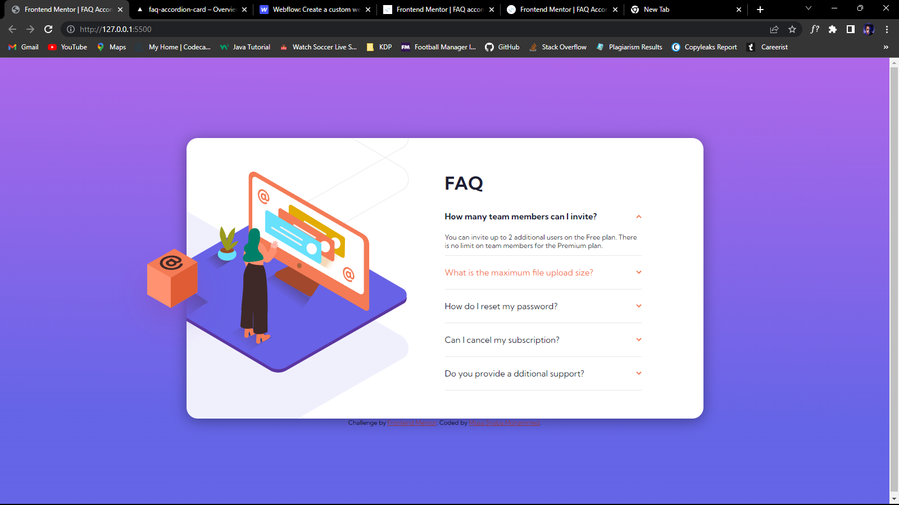

# Frontend Mentor - FAQ accordion card solution

This is a solution to the [FAQ accordion card challenge on Frontend Mentor](https://www.frontendmentor.io/challenges/faq-accordion-card-XlyjD0Oam). Frontend Mentor challenges help you improve your coding skills by building realistic projects.

## Table of contents

- [Overview](#overview)

  - [Screenshot](#screenshot)
  - [Links](#links)

- [My process](#my-process)

  - [Built with](#built-with)
  - [Continued development](#continued-development)

- [Author](#author)

### Screenshot

### Links

- Solution URL: [Here](https://github.com/walidshaba/FAQ-Accordion--Card-.git)
- Live Site URL: [Here](https://faq-accordion-card-gamma-nine.vercel.app/)

## My process

### Built with

- Semantic HTML5 markup
- CSS custom properties
- Flexbox
- CSS Grid

### Continued development

I would be doing a future Redevelopment of this project as it is not perfect yet but it works

## Author

- Website - [My Website](https://musashaba-1490d.web.app/)
- Frontend Mentor - [@walidshaba](https://www.frontendmentor.io/profile/codewithmshaba)
- Twitter - [@codewithmshaba](https://www.twitter.com/codewithmshaba)
